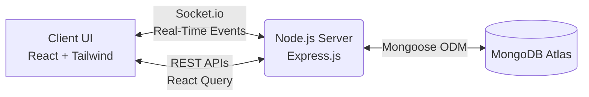

<div align="center">
  
  
  
  
  
  <h1 align="center">ConnectX</h1>
  <p align="center">
    <strong>A Production-Ready Real-Time Chat Application</strong>
  </p>
  
  <p align="center">
    <a href="#"></a>
    <a href="#"></a>
    <a href="#"></a>
    <br/>
    <a href="#"></a>
    <a href="#"></a>
    <a href="#"></a>
    <a href="#"></a>
  </p>
</div>

## 📖 Overview

ConnectX is a robust, full-stack real-time chat application inspired by modern messaging platforms like WhatsApp and Telegram. It features instant message broadcasting, active presence tracking, typing indicators, and persistent chat history. Built with a clean architecture and scalable design principles, it serves as a showcase for production-level software engineering.

## ✨ Key Features

- ⚡ **Real-Time Communication**: Instant, bi-directional event-based messaging powered by Socket.io.
- 💾 **Persistent Chat History**: All messages are securely saved to MongoDB Atlas, ensuring no data is lost upon refresh.
- 👀 **Live Presence**: Real-time tracking of online users and a dynamic active users count.
- ✍️ **Typing Indicators**: Bouncing animation indicators show exactly who is currently typing.
- 🎨 **Premium UI/UX**: Designed with Tailwind CSS v4, featuring a beautiful interface, dark mode support, and intelligent auto-scrolling.
- 🛡️ **Production Grade Security**: Implements `helmet`, `cors`, `express-rate-limit`, and payload validation.

## 🏗️ Architecture



### Folder Structure
The application follows a clean separation of concerns:
- **`backend/`**: Modular API routes, schemas, controllers, and dedicated socket event handlers.
- **`frontend/`**: Vite-powered React app utilizing custom hooks (`useSocket`, `useChat`) and a centralized `AuthContext`.

## 🚀 Getting Started

### Prerequisites
- [Node.js](https://nodejs.org/) (v18 or higher)
- [MongoDB](https://www.mongodb.com/cloud/atlas) URI string or local instance

### 1. Backend Setup

```bash
cd backend
npm install

# Create environment configuration
cp .env.example .env
```

**Configure `backend/.env`:**
```env
PORT=5000
MONGODB_URI=mongodb+srv://<user>:<password>@cluster0.mongodb.net/chat_app
CLIENT_URL=http://localhost:5173
NODE_ENV=development
```

Start the backend development server:
```bash
npm run dev
```

### 2. Frontend Setup

```bash
cd frontend
npm install

# Create environment configuration
cp .env.example .env
```

**Configure `frontend/.env`:**
```env
VITE_API_URL=http://localhost:5000/api
VITE_SOCKET_URL=http://localhost:5000
```

Start the frontend Vite server:
```bash
npm run dev
```

## 📡 API Reference

A fully documented **Postman Collection** (`postman_collection.json`) is included in the root directory.

### REST Endpoints
| Method | Endpoint | Description |
|---|---|---|
| `GET` | `/api/health` | Service health, DB state, and uptime check |
| `GET` | `/api/messages?page=1&limit=50` | Retrieve paginated message history |
| `POST` | `/api/messages` | Create and store a new message |

### Socket.io Events
| Event | Direction | Payload / Action |
|---|---|---|
| `join` | Client ➡️ Server | `{ username }` - Register user session |
| `message:send` | Client ➡️ Server | `{ username, message }` - Send payload |
| `message:new` | Server ➡️ Client | Broadcasts newly saved message object |
| `typing:start` / `:stop` | Bi-directional | Broadcasts typing states |
| `user:online` / `:offline` | Server ➡️ Client | Broadcasts active user roster |

## 🌐 Deployment

The backend is configured for easy deployment to platforms like **Render**, **Railway**, or **Heroku**. 
A `render.yaml` infrastructure-as-code file is included.

1. Push to your GitHub repository.
2. Connect your repository to Render.
3. Render automatically provisions the `web` service from `render.yaml`.
4. Ensure you set your production `MONGODB_URI` and `CLIENT_URL` in the environment variables dashboard.
5. Deploy the `frontend/` directory to Vercel, Netlify, or Render Static Sites.

## 📜 License

This project is licensed under the MIT License.
